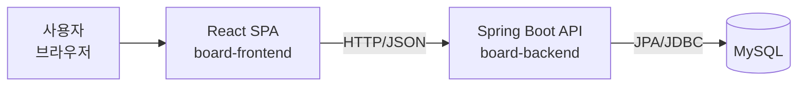
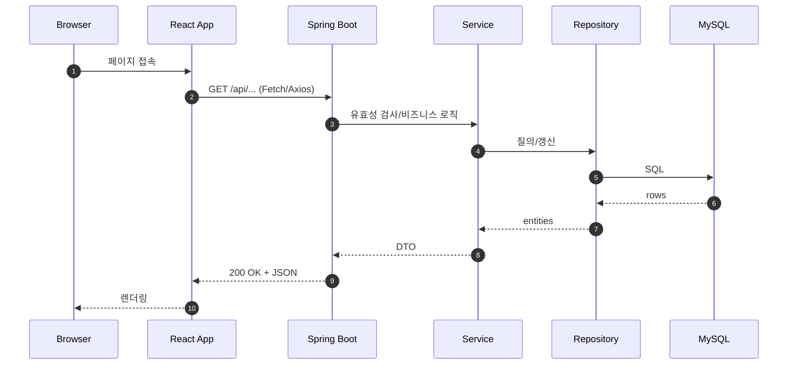

# Board Project

프론트엔드(React + TypeScript)와 백엔드(Gradle 기반 JVM 앱) 기반의 게시판 프로젝트

## 아키텍쳐

### 1) 전체 구조(컨텍스트/컨테이너)



### 2) 요청 흐름(시퀀스)



## 요구 사항

- Node.js LTS, npm
- Java 17+ (권장), Gradle Wrapper는 리포지토리에 포함됨

## 빠른 시작

프론트엔드와 백엔드를 각각 별도 터미널에서 실행합니다.

### 프론트엔드 (board-frontend)

```sh

cd board-frontend

npm install

npm start

```

- 테스트:

  ```sh

  npm test

  ```
- 프로덕션 빌드:

  ```sh

  npm run build

  ```

자세한 스크립트는 [board-frontend/package.json](board-frontend/package.json) 참조.

### 백엔드 (board-backend)

```sh

cd board-backend

# 빌드

./gradlew build        # Windows: gradlew.bat build

# 테스트

./gradlew test

# 실행(프로젝트에 따라 아래 중 하나 사용)

./gradlew bootRun      # Spring Boot일 경우

./gradlew run          # application 플러그인 사용 시

# 또는 JAR 실행(빌드 후)

java -jar build/libs/<생성된-jar파일>.jar

```

Gradle 설정 및 태스크는 [board-backend/build.gradle](board-backend/build.gradle) 참고.

## VS Code 개발 환경

- 디버깅/실행 구성: [.vscode/launch.json](.vscode/launch.json)
- 편집기 설정: [.vscode/settings.json](.vscode/settings.json)
- 테스트

  - 프론트엔드: Jest(CRA 기본) — [board-frontend/src/App.test.tsx](board-frontend/src/App.test.tsx)
  - 백엔드: Gradle(Test) 태스크 — `./gradlew test`

## 빌드 산출물

- 프론트엔드: `board-frontend/build/`
- 백엔드: `board-backend/build/` (라이브러리: `build/libs/`)

## 참고 문서

- 도메인/설계/DB 관련 문서: [notes/concept_and_design/](notes/concept_and_design), [notes/database/](notes/database)
- 프론트엔드 패키지 참고: [notes/npm_packages/](notes/npm_packages)
